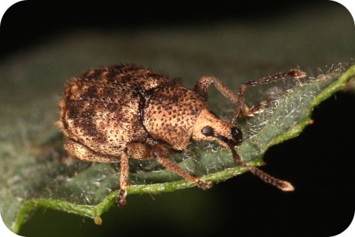
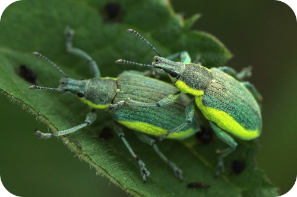
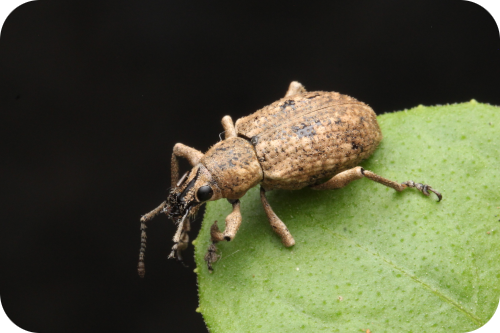

<table style='border: 0'><tr>
<td></td>
<td></td>
<td></td>
</tr>
<tr><td colspan="6" style="text-align: center">Valid Species: <ValidSpeciesCount/>; <ProjectStats :data="['Taxon names', 'Collection objects', 'Project sources', 'Documents', 'Images']" class="capitalize"/></td></tr>
</table>

## Overview
Welcome to *{{ frontmatter.project }}*, a website of taxon pages generated from the {{ frontmatter.project }} Project, a comprehensive collaborative effort managed in [TaxonWorks](https://taxonworks.org). 

## Get started!
<autocomplete-otu class="w-80"/>

## Announcements
* 2025-07-21 - Jakob Jilg joined the effort to help migrate the **World Catalogue of the Curculionidae: Lixinae: Cleonin** by Massimo Meregalli into TaxonWorks.
* 2024-11-15 - Massimo Meregalli agreed to transfer his **World Catalogue of the Curculionidae: Lixinae: Cleonin** to TaxonWorks to be made available via Curculionidae of the World Online.
* 2024-10-15 - Curculionidae of the World Online has been released!

## Disclaimer
This catalog **is a work in progress**. So far the effort has been dedicated to the subfamily Entiminae. If you find information gaps in Entiminae, or if you would like to join the effort to update any Curculionid group, just send us an email at WeevilWorkers@gmail.com.

## Find out more
Learn how to collaborate with the {{ frontmatter.project }} project. Contact information, technical details, and more are available at [About](/about).
