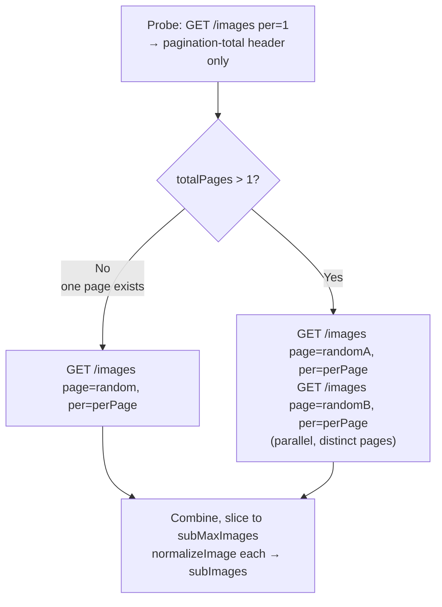
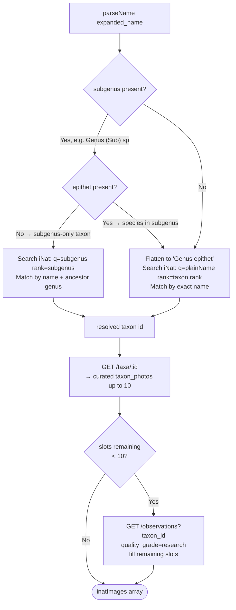
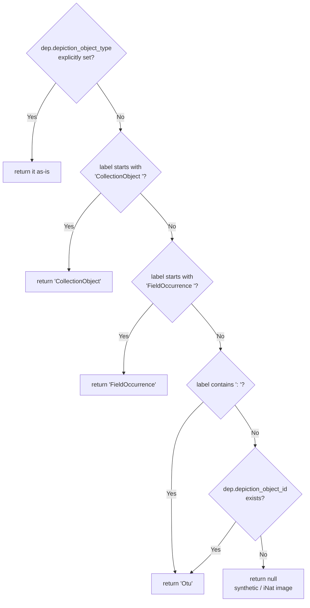
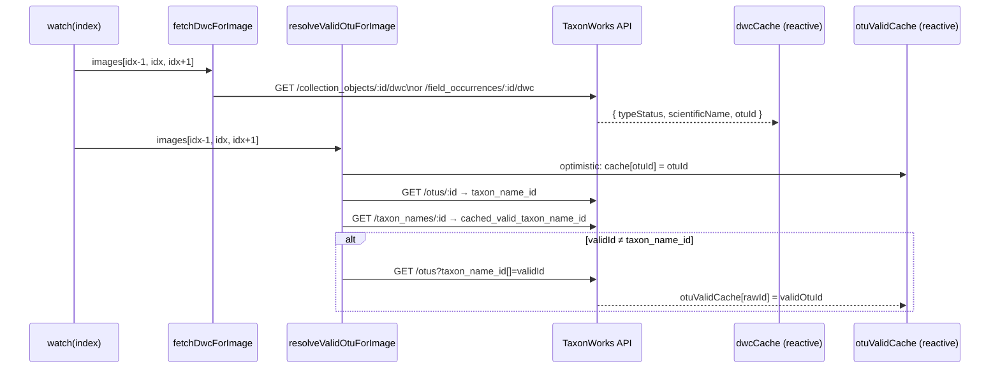

# PanelGallery — Architecture & Decision Trees

Panel id: `panel:gallery-v2`  
Entry point: `main.js` → registers `PanelGallery.vue`  
Custom viewer: `GalleryViewer.vue` (fork of the vanilla `ImageViewer`)

---

## Component tree

```
PanelGallery.vue
├── GalleryMainImage        (package, @/components/Gallery/GalleryMainImage.vue)
├── thumbnail strip         (inline <div> loop)
└── GalleryViewer.vue       (local fork)
    ├── ControlImagePrevious / ControlImageNext   (package)
    ├── DwcTable            (shared from panels/PanelMapV2/components/DwcTable.vue)
    └── VModal (Teleport)   (citation detail popup)
```

---

## Image-source decision tree (`PanelGallery.vue`)

This is the first and most important decision: where do the images come from?

```mermaid
flowchart TD
    A([Component mounted / SSR prefetch]) --> B[store.loadImages otuId\n→ GET /otus/:id/inventory/images.json]
    B --> C{store.images\nreturned?}
    C -- "length > 0" --> D[✅ Use TaxonWorks images\n twImages = store.images]
    C -- "length === 0" --> E{taxon.id\navailable?}
    E -- No --> G
    E -- Yes --> F[fetchSubordinateFallback\n→ GET /images?taxon_name_id\[]=taxon.id]
    F --> F2{any sub-taxon\nimages found?}
    F2 -- Yes --> H[✅ Use subordinate-taxon images\n subImages]
    F2 -- No --> G{taxon.expanded_name\navailable?}
    G -- No --> Z([No images — card hidden])
    G -- Yes --> I[fetchInatFallback\n→ resolve iNat taxon id\n→ GET curated photos + observations]
    I --> J{iNat returned\nimages?}
    J -- Yes --> K[✅ Use iNaturalist images\n inatImages]
    J -- No --> Z

    D --> ACTIVE
    H --> ACTIVE
    K --> ACTIVE
    ACTIVE([activeImages\npriority: twImages → subImages → inatImages])
```

`activeImages` is the live computed that the gallery and viewer both read from:

```js
// priority order (first non-empty wins)
if (twImages.length)   return twImages
if (subImages.length)  return subImages
return inatImages
```

---

## Subordinate-taxa fallback — fetch strategy

3 requests, 2 sequential round trips. Each data page fetches `ceil(subMaxImages / 2)` images (`perPage`):



The probe uses `per=1` to minimise transferred data — only the `pagination-total` header is needed. `totalPages` is then computed as `ceil(total / perPage)`. The two data requests are fired in parallel via `Promise.all`.

For taxa with only one page of results (`totalPages = 1`) a single data request is made instead.

Constant: `SUB_IMAGE_TIMEOUT_MS = 8000`.

### Configuring `subMaxImages` via YAML

`subMaxImages` is passed as a prop through the framework's `bind:` mechanism in `config/taxa_page.yml`:

```yaml
- - - id: panel:gallery-v2
      bind:
        subMaxImages: 10
```

Any key under `bind:` is spread onto the panel component via `v-bind` in `PageLayout.vue`. Change the number there; no code change needed.

---

## iNaturalist fallback — name resolution

`taxon.expanded_name` (e.g. `"Curculio (Curculio) glandium"`) is parsed before querying iNat, because iNat does not use the subgenus notation.



Each iNat image is normalized to the same shape as a TW image so the rest of the gallery is source-agnostic:

```
{ id, thumb, medium, original, attribution, source, depictions: [{ label: taxonName }] }
```

---

## Depiction type inference (`GalleryViewer.vue`)

The `/inventory/images.json` endpoint does not always serialize `depiction_object_type`. `inferDepictionType` reconstructs it from the label string format:



---

## imageDisplay computed — name & metadata assembly

For each image shown in the viewer, `imageDisplay` collects all metadata into one object. It runs three name-resolution passes in priority order:

```mermaid
flowchart TD
    IMG[current image's depictions\[]]

    IMG --> P1{OTU depiction\nfound?}
    P1 -- Yes --> P1A[Parse label before ': '\nsplitName → italic + plain\nRead otuValidCache for link target]
    P1 -- No --> P2{CO/FO depiction found\nAND in dwcCache?}
    P2 -- Yes --> P2A[Use dwcCache scientificName\nsplitName → italic + plain\nOTU link from dwcCache.otuId]
    P2 -- No --> P3{synthetic dep\nnull type with label?}
    P3 -- Yes --> P3A[Use label directly as name\n no OTU link]
    P3 -- No --> P3B[name = null\n nothing shown]

    P1A --> OUT
    P2A --> OUT
    P3A --> OUT
    P3B --> OUT

    OUT[imageDisplay:\n name italic + plain\n otuId for RouterLink\n hasOtu flag\n otuDesc figure label\n coEntries\[]\n]
```

`coEntries` — one entry per CO/FO depiction:

| Field | Source |
|---|---|
| `typeStatus` | `dwcCache[id].typeStatus` |
| `figureLabel` | `dep.figure_label` |
| `caption` | `dep.caption` |
| `dwcOk` | cache entry exists and no error |
| `dwcLoading` | cache entry is `null` (request in flight) |

Entries are filtered out when the DWC fetch failed **and** there is no own content to show (no figure label, no caption) — avoids rendering a broken ⓘ button with nothing beneath it.

---

## DWC prefetch & OTU validity chain



Because `dwcCache` and `otuValidCache` are `reactive({})`, assigning a key triggers Vue reactivity and causes `imageDisplay` to recompute automatically — no explicit invalidation needed.

---

## Image loading state

`GalleryViewer` tracks whether the full-size image has finished loading:

- `isLoading` starts `true` and is reset to `true` on every index change (before the browser fetches the new src).
- `onMounted` attaches native `load` and `error` listeners to the `` element; either event sets `isLoading = false`.
- A `complete` check runs immediately in `onMounted` to clear the flag when the first image is already in the browser cache.
- While `isLoading` is true: the image renders at `opacity-20` and a `<VSpinner>` overlay is shown, making navigation feedback unambiguous even on slow connections.

---

## Keyboard & lifecycle

| Event | Listener | Action |
|---|---|---|
| `ArrowLeft` | `keyup` | emit `previous` (if `props.previous`) |
| `ArrowRight` | `keyup` | emit `next` (if `props.next`) |
| `Escape` | `keyup` | emit `close` |
| `Tab` / `Shift+Tab` | `keydown` | `trapFocus` — wraps focus within the dialog |
| mount | — | save `document.activeElement`, add listeners, `body.overflow-hidden` |
| unmount | — | remove listeners, restore scroll, restore focus to saved element |

`Tab` is handled on `keydown` (not `keyup`) because the browser moves focus on `keydown`; intercepting on `keyup` would run one step too late to prevent the focus escaping the overlay.

### Focus trap

`trapFocus` queries all focusable elements inside `viewerRef` (`a[href]`, non-disabled `button`, positive `tabindex`) and wraps:
- Tab on the last element → jumps to first
- Shift+Tab on the first element → jumps to last

### Focus restoration

`previouslyFocusedElement` captures `document.activeElement` at mount. On `onUnmounted` it calls `.focus()` on it, returning the user to the element that opened the viewer (typically the thumbnail they clicked).

### ARIA

The root `<div>` carries `role="dialog"`, `aria-modal="true"`, and `aria-label="Image viewer"`. `aria-modal` tells screen readers to treat the rest of the page as inert while the overlay is open.

---

## Data shape — normalized image object

All three sources (TaxonWorks, subordinate taxa, iNaturalist) produce the same shape so the gallery, thumbnail strip, and viewer need no source-awareness:

```ts
{
  id:          number | string,
  thumb:       string,   // URL
  medium:      string,   // URL
  original:    string,   // URL
  attribution: { label: string },
  source:      { label: string },  // may contain <a> HTML for iNat links
  citations:   Citation[],         // TW only; empty array for iNat / sub fallback
  depictions:  Depiction[]         // shape depends on source — see inferDepictionType
}
```

---

## Props summary

### `PanelGallery.vue`

| Prop | Type | Default | Purpose |
|---|---|---|---|
| `otuId` | String\|Number | required | Primary key for TW image fetch |
| `taxon` | Object | `undefined` | Needs `.id` (sub-taxa fallback) and `.expanded_name` (iNat fallback) |
| `otu` | Object | `undefined` | Available but not currently used inside the component |
| `sort_order` | Array | `[]` | Forwarded to `store.loadImages` |
| `subMaxImages` | Number | `10` | Max images returned by the subordinate-taxa fallback. Set via `bind:` in `taxa_page.yml`. |

### `GalleryViewer.vue`

| Prop | Type | Purpose |
|---|---|---|
| `images` | Array | Full image list |
| `index` | Number | Currently displayed index |
| `next` | Boolean | Whether a next image exists |
| `previous` | Boolean | Whether a previous image exists |

Emits: `close`, `next`, `previous`, `selectIndex(i)`
